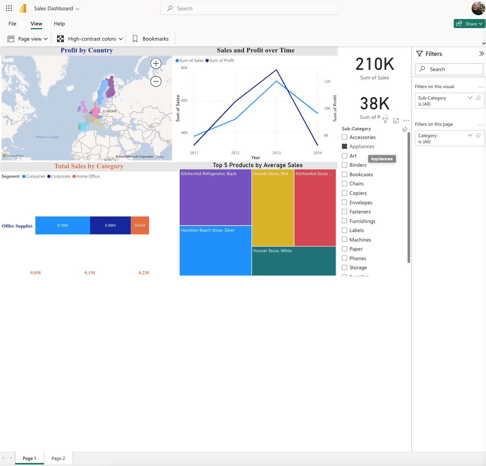

# 📊 Sales Analysis Dashboard/ Interactive Insights <a href="https://powerbi.microsoft.com/" target="_blank" rel="noreferrer"> **Power BI** </a>&nbsp;  

 [Explore the Interactive Dashboard](https://justit831-my.sharepoint.com/:u:/g/personal/justincracium_bootcamp_justit_co_uk/EXAodEp3YfdGofxdK24bYPgBPEmCYP8DBzcpgQZHM11sLQ?e=lP8mJS) |  [Original Data Source](https://justit831-my.sharepoint.com/:u:/g/personal/justincracium_bootcamp_justit_co_uk/EXAodEp3YfdGofxdK24bYPgBPEmCYP8DBzcpgQZHM11sLQ?e=lP8mJS)</a> 

**Objective:** To utilise Power BI to **import**, **clean**, and analyse sales data from provided CSV files. The goal was to build an interactive report demonstrating understanding of data modelling (**Star Schema**), **DAX** calculations, and effective **visualisation** techniques learned in class.

**Power BI Implementation Highlights:**

* **Data Preparation & Modelling:**
    * **Data Import & Cleaning:** Successfully **imported** data from the two tabs sheets `ListOfOrders.csv` and `OrderBreakdown.csv`. Utilised Power BI's built-in capabilities to **clean** the dataset, ensuring data types were correct and preparing it for analysis. Datasets were merged based on `Order ID`.
    * **Structured Data Model:** Designed a **Star Schema** by identifying and relating **Fact** table concepts (like sales transactions from `OrderBreakdown`) and **Dimension** table concepts (like customer details, product details, dates from `ListOfOrders`). Appropriate **one-to-many relationships** were established between dimensions and facts.
* **DAX Calculations for Analysis:**
    * **Core Metrics:** Created fundamental **DAX measures** using functions like **`SUM`** to calculate essential figures such as 'Total Sales' and 'Total Profit'.
    * **Context Modification:** Leveraged the **`CALCULATE`** DAX function to **modify the context** in which calculations were performed, enabling more specific analyses (e.g., potentially isolating sales for a specific region or time period within other calculations).
    * **Derived Insights:** Developed additional DAX logic to derive analytical results, such as calculating profit margins and determining rankings like the 'Top 5 Products' shown in the visuals.
* **Interactive Visualisation & Reporting:**
    * **Diverse Visuals:** Employed a range of standard Power BI **visualisations** (including Bar charts, Line charts, and Maps) to present the data effectively, addressing different analytical questions (trends, comparisons, geographic patterns, rankings).
    * **Interactive Exploration:** Configured the visuals to interact with each other; for example, selecting data in one visual dynamically filters the information displayed in others, allowing for intuitive data exploration.
    * **User Filtering:** Included controls allowing users to filter the report data based on key dimensions like category, region, or date.
    * **Clear Communication:** Assembled the visuals into a coherent report page (`sales_dashboard.png`), focusing on clear labelling and layout for effective communication of insights.

---

### Core Power BI Competencies Demonstrated:

* **Data Import & Cleaning (using Power BI capabilities)**
* **Data Modelling (Star Schema, Relationships)**
* **DAX Calculations (SUM, CALCULATE, Measures for KPIs & Ranking)**
* **Visualisation & Interactive Report Building**

---

## 📊 Example Output: Key Visual Insights

<table>
   <tr>
    <td colspan="2" align="center">
      
    </td>
  </tr>
   <tr>
    <td></td>
    <td></td>
  </tr>
  <tr>
    <td></td>
    <td></td>
  </tr>
  <tr>
    <td colspan="2" align="center">
        
    </td>
  </tr>
</table>

### 🧑‍💻 Created by [tunjis](https://github.com/tunjis) 

-------------

* 🌍  Based in <a href="https://maps.app.goo.gl/hMxhRX5ptQAAkL7NA/" target="_blank">**London**</a>
* 🖥️  See my portfolio at [Data’s the new oil. I’m the refinery.](https://github.com/tunjis?tab=repositories)
* 📫  Contact me via my [LinkedIn profile](https://linkedin.com/in/justincraciun/)
* 🧠  Learning Data Science
* 🤝  Open to collaborating on interesting projects
* ⚡  AI enthusiast

-------------

### 🛠️ Technical Skills
<a href="https://www.python.org/" target="_blank" rel="noreferrer"> **Python** </a>&nbsp;
<a href="https://www.microsoft.com/en-us/microsoft-365/excel" target="_blank" rel="noreferrer"> **Microsoft Excel** </a>&nbsp;
<a href="https://www.mysql.com/" target="_blank" rel="noreferrer"> **MySQL** </a>&nbsp;
<a href="https://www.tableau.com/" target="_blank" rel="noreferrer"> **Tableau** </a>&nbsp;
<a href="https://powerbi.microsoft.com/" target="_blank" rel="noreferrer"> **Power BI** </a>&nbsp;  

<a href="https://azure.microsoft.com/" target="_blank" rel="noreferrer"> **Microsoft Azure** </a>&nbsp;
<a href="https://cloud.google.com/" target="_blank" rel="noreferrer"> **Google Cloud** </a>&nbsp;
&nbsp;&nbsp;  

-------------

### 🔁 Socials

<a href="https://www.github.com/tunjis/" target="_blank" rel="noreferrer">
  <picture>
    <source media="(prefers-color-scheme: dark)" srcset="https://raw.githubusercontent.com/danielcranney/readme-generator/main/public/icons/socials/github-dark.svg" />
    <source media="(prefers-color-scheme: light)" srcset="https://raw.githubusercontent.com/danielcranney/readme-generator/main/public/icons/socials/github.svg" />
    
  </picture>
</a>&nbsp;
<a href="https://linkedin.com/in/justincraciun/" target="_blank" rel="noreferrer">
  <picture>
    <source media="(prefers-color-scheme: dark)" srcset="https://raw.githubusercontent.com/danielcranney/readme-generator/main/public/icons/socials/linkedin-dark.svg" />
    <source media="(prefers-color-scheme: light)" srcset="https://raw.githubusercontent.com/danielcranney/readme-generator/main/public/icons/socials/linkedin.svg" />
    
  </picture>
</a>&nbsp;&nbsp;  

-------------

### ☕ Support Me

&nbsp;&nbsp;

